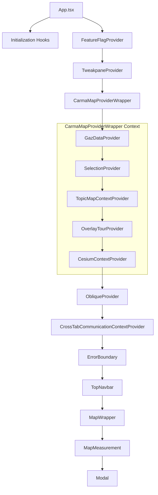

# Geoportal Application Overview

_Last updated: 2025-05-26T09:00:58.375Z_

## Workspace Information

This overview provides a snapshot of the Geoportal application and its Redux state management flow.

## Application Structure

**Application Structure Overview:**

1. **App.tsx** - Main application entry point with provider setup
2. **Initialization Hooks** - Parse URL parameters and load configuration:
   - `useAppConfig`
   - `useManageLayers`
   - `useCesiumSearchParams`
   - `useSyncToken`
3. **Provider Hierarchy** - Context providers wrapping the application
4. **CarmaMapProviderWrapper** - Wraps multiple mapping-related providers:
   - `GazDataProvider` - Gazetteer search data
   - `SelectionProvider` - Feature selection state
   - `TopicMapContextProvider` - Map context and configuration
   - `OverlayTourProvider` - Help overlay system
   - `CesiumContextProvider` - 3D mapping engine
5. **Main UI Components** - Core application interface

**Key Source Files:**

- [`app/App.tsx`](src/app/App.tsx) - Main application entry point
- [`app/hooks/`](src/app/hooks/) - Initialization and configuration hooks
- [`app/components/GeoportalMap/`](src/app/components/GeoportalMap/) - Map-related components
- [`app/components/TopNavbar/`](src/app/components/TopNavbar/) - Navigation components
- [`app/store/slices/`](src/app/store/slices/) - Redux state management

## Redux Store Structure

### 📦 features slice

_Source: [features.ts](src/app/store/slices/features.ts)_

**State Properties:**
- `features`
- `infoText`
- `loading`
- `nothingFoundIDs`
- `preferredLayerId`
- `secondaryInfoBoxElements`
- `selectedFeature`
- `vectorInfo`
- `vectorInfos`

### 📦 layers slice

_Source: [layers.ts](src/app/store/slices/layers.ts)_

**State Properties:**
- `favorites`
- `thumbnails`

### 📦 mapping slice

_Source: [mapping.ts](src/app/store/slices/mapping.ts)_

**State Properties:**
- `backgroundLayer`
- `clickFromInfoView`
- `configSelection`
- `focusMode`
- `layers`
- `layersIdle`
- `libreMapRef`
- `paleOpacityValue`
- `savedLayerConfigs`
- `selectedLayerIndex`
- `selectedLuftbildLayer`
- `selectedMapLayer`
- `showFullscreenButton`
- `showHamburgerMenu`
- `showLeftScrollButton`
- `showLocatorButton`
- `showMeasurementButton`
- `showRightScrollButton`
- `startDrawing`

### 📦 measurements slice

_Source: [measurements.ts](src/app/store/slices/measurements.ts)_

**State Properties:**
- `activeShape`
- `deleteAll`
- `drawingShape`
- `lastActiveShapeBeforeDrawing`
- `mapMovingEnd`
- `mode`
- `moveToShape`
- `shapes`
- `showAll`
- `updateShape`
- `updateTitleStatus`
- `visibleShapes`

### 📦 print slice

_Source: [print.ts](src/app/store/slices/print.ts)_

**State Properties:**
- `dpi`
- `ifMapPrinted`
- `ifPopupOpend`
- `isLoading`
- `name`
- `orientation`
- `printError`
- `redrawPreview`
- `scale`

### 📦 ui slice

_Source: [ui.ts](src/app/store/slices/ui.ts)_

**State Properties:**
- `activeTabKey`
- `allow3d`
- `allowChanges`
- `mode`
- `showInfo`
- `showInfoText`
- `showLayerButtons`
- `showLayerHideButtons`
- `showResourceModal`
- `zenMode`
