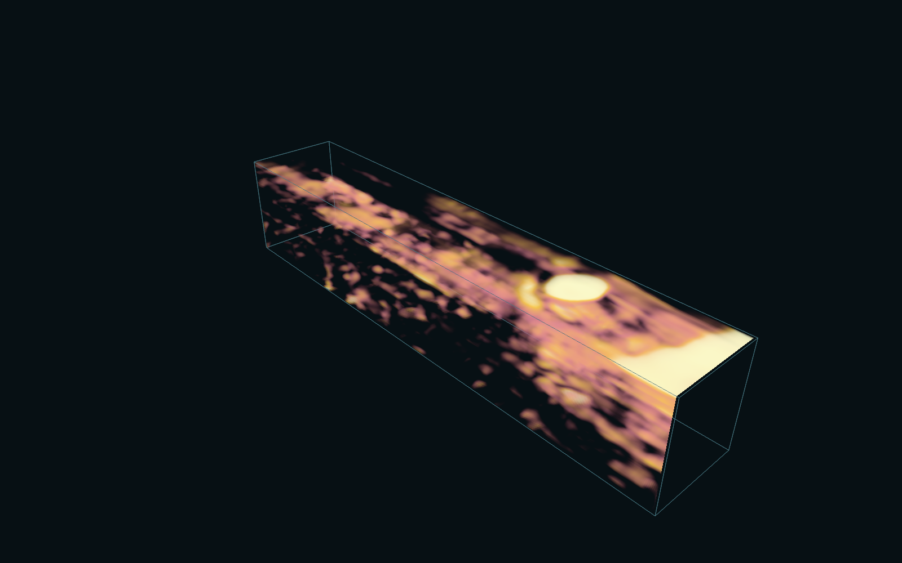
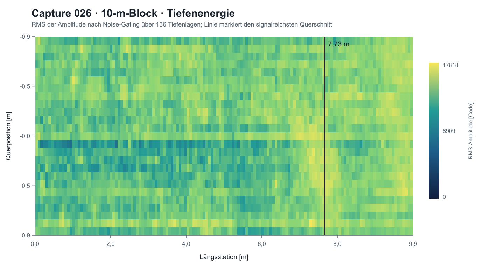
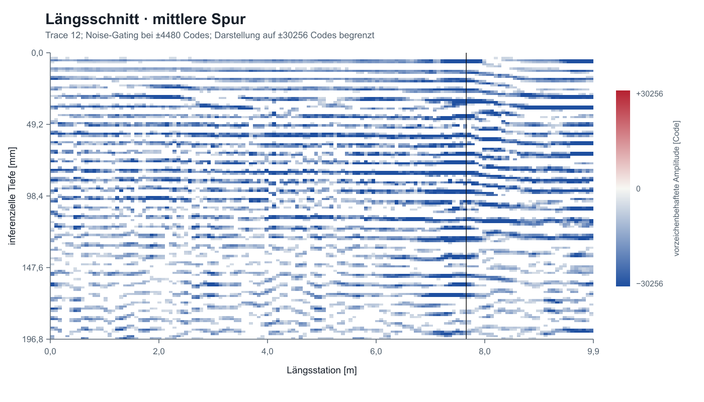
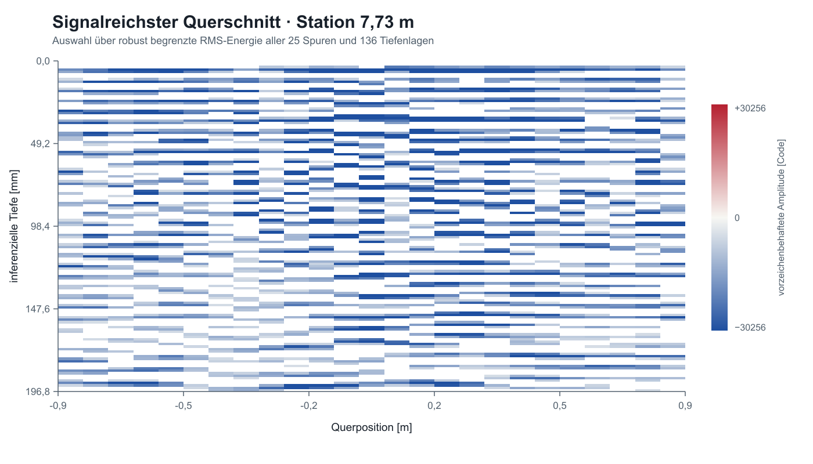
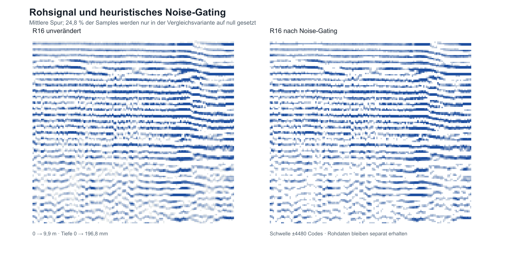

# Datenübersicht Ölberg/TWIN4ROAD

Stand: 16. Juli 2026. Diese Übersicht beschreibt die in [wupp#4068](https://github.com/cismet/wupp/issues/4068) bereitgestellte Befahrung am Wuppertaler Ölberg vom 11. September 2025, die lokal bereits vorhandenen Materialisierungen und die daraus für die Pointcloud Stories erzeugten Artefakte.

## Kurzfazit

- Sechs der acht verlinkten Lieferungen sind vollständig heruntergeladen, archivgeprüft und per SHA-256 identifiziert. Panorama und Planar 1 sind derzeit an der Quelle nicht erreichbar.
- Die Georadar-Lieferung enthält keine Geräte-Rohdaten. Das quellenächste Produkt sind 27 mit `txt2las64` erzeugte `*_vol.laz`-Dateien mit Geometrie und 16-Bit-`Intensity`.
- Aus der ursprünglichen Punktreihenfolge lässt sich ein regulärer Amplitudentensor rekonstruieren. Zeitachse, Antennenparameter, Kalibrierung, Laufzeit-Tiefen-Transformation und Bohrkerndaten fehlen jedoch.
- Der derzeitige Georadar-COPC enthält nur 11 der 27 Volumen-Captures. Der COPC ist deshalb ein Viewer-Artefakt, aber keine vollständige Materialisierung der Lieferung.

## Verbindliches Raumbezugs-Gate

Jedes räumliche Asset muss vor der produktiven Aufnahme in eine gemeinsame 3D-Szene einen belegten nativen Raumbezug besitzen. Der Nachweis umfasst:

- horizontales CRS mit Achsen, Einheit, geodätischem Datum und, bei dynamischen Datums, Realisierung und Epoche;
- vertikales CRS beziehungsweise ausdrücklich benannte Höhenart, Einheit und Bezugsfläche; relative Tiefen oder höhenlose 2D-Daten müssen als solche deklariert sein;
- eine Primärquelle für diese Angaben: eingebettete Asset-Metadaten oder eine eindeutig auf das konkrete, unveränderliche Providerobjekt bezogene Dokumentation;
- die vollständige, reproduzierbare Transformation in das kanonische Szenenframe `EPSG:4978` mit ellipsoidischen Höhen, einschließlich verwendeter Vertikalgrids und deren Version oder Prüfsumme;
- eine Plausibilitätsprüfung gegen die tatsächlich gespeicherten Koordinaten.

Dateinamen, URL-Namen, räumliche Nähe, visuelle Deckung, manuelle Offsets und vom Viewer ergänzte CRS-Tags sind kein Nachweis. Ableitungen erben den schlechtesten Nachweisstatus ihrer Quellen und dürfen fehlende Provenienz nicht durch ein neu gesetztes CRS aufwerten. Ein Asset mit unbekanntem oder widersprüchlichem relevantem Raumbezug darf nur in einem sichtbar markierten Quarantäne-/Diagnosemodus geladen werden. Es darf weder Standardbestandteil der multimodalen Szene noch Referenz für Alignment- oder Fehlermetriken sein.

Die Status bedeuten:

- **bestätigt:** vollständiger relevanter Raumbezug ist am konkreten Asset belegt und mit dessen Koordinaten vereinbar;
- **teilbestätigt:** einzelne Bestandteile sind belegt, aber mindestens ein für die 3D-Platzierung notwendiger Bestandteil fehlt;
- **unbestätigt:** die Szene verwendet eine Annahme ohne assetbezogenen Primärnachweis;
- **widersprüchlich:** Asset-Metadaten und Viewer-/Ableitungsmetadaten nennen unterschiedliche Raumbezüge.

Das vollständige Register mit Quell-Hashes, angewandten Transformationen, Korrektur-IDs und Garantiegrenzen steht in [Raumbezug und Szenentransformation](raumbezug-und-szenentransformation.md).

### Audit der multimodalen Szene

| Asset in der Szene                       | Horizontaler Bezug                                                                                         | Vertikaler Bezug                                                                                                                                        | Status                                                                                                  | Konsequenz                                                                                                                                                                                                                                                           |
| ---------------------------------------- | ---------------------------------------------------------------------------------------------------------- | ------------------------------------------------------------------------------------------------------------------------------------------------------- | ------------------------------------------------------------------------------------------------------- | -------------------------------------------------------------------------------------------------------------------------------------------------------------------------------------------------------------------------------------------------------------------- |
| Mesh 2024                                | Root-Metadaten nennen als Ziel `EPSG:4978`; Quell-WKT nennt `EPSG:25832`                                   | Quell-WKT nennt `EPSG:7837` DHHN2016 und `GCG2016.gtx`; ECEF-Rücktransformation des Root-Ursprungs ergibt konsistente ellipsoidische und DHHN2016-Höhen | **bestätigt** für das technische Szenenframe; Erzeugungsepoche und Genauigkeitsbericht fehlen weiterhin | Darf als `EPSG:4978` ohne freien Vertikaloffset montiert werden; die Metadaten allein belegen keine absolute Genauigkeit im Zentimeterbereich                                                                                                                        |
| Wuppertaler NIV-Punkte                   | Jedes Datensatzobjekt enthält eine GeoJSON-Punktgeometrie mit `EPSG:25832`                                 | Feld `hoehe_ueber_nhn2016` benennt DHHN2016 explizit                                                                                                    | Quellreferenz **bestätigt**; Offline-Transformation und Montage **rechnerisch verifiziert**             | 2.622 gültige Punkte werden mit dem vollständigen GCG2016-Grid vorab nach `EPSG:4978` transformiert und über dasselbe ECEF-Frame wie das Mesh montiert. Das garantiert Reproduzierbarkeit, nicht die physische Zentimetergenauigkeit oder eine fehlende WGS84-Epoche |
| Panorama-Posen                           | `reference.csv` enthält Breite/Länge und `projectedX/Y`, aber keine CRS-ID, Datumsrealisierung oder Epoche | `altitude_ellipsoidal` benennt die Höhenart; `projectedZ` besitzt kein ausgewiesenes Vertikaldatum                                                      | **teilbestätigt**                                                                                       | Ellipsoidische Höhe ist als Typ belegt, der vollständige 3D-Raumbezug jedoch nicht. Die derzeitige Deklaration `EPSG:25832`/DHHN2016 ist bis zu einer Providerbestätigung nur eine Arbeitshypothese                                                                  |
| Planar-2- und Planar-3-Posen             | Gleiches undeklariertes `reference.csv`-Schema wie bei den Panoramen                                       | Ellipsoidische Höhe ist vorhanden, die Szene verwendet derzeit aber `projectedZ` und behandelt es ohne Primärnachweis als DHHN2016                      | **teilbestätigt**, aktuelle Szenennutzung **unbestätigt**                                               | Nicht produktiv räumlich platzieren, bis CRS und Vertikaldatum bestätigt und der Import auf die belegte Höhenkomponente umgestellt sind                                                                                                                              |
| Georadar-T0 und Volumen-LAZ              | Eingebetteter LAS-GeoKey ist `EPSG:32632`; die abgeleiteten Manifeste behaupten `EPSG:25832`               | T0 trägt `Z=0` als relative Oberflächenreferenz; Volumen-Z ist eine skalierte relative Tiefenachse. Eine absolute Höhe ist nicht geliefert              | **widersprüchlich** horizontal, **unbestätigt** vertikal                                                | Abgeleitete Manifeste dürfen nicht `EPSG:25832`/DHHN2016 behaupten. Fester Anker `163.311`, Mesh-Raycast und lokale Offsets ersetzen keinen Höhendatumsnachweis                                                                                                      |
| DSM 2024 und DGM 2020 als Terrainprofile | Quantized-Mesh-Endpunkte und Resource-Namen belegen kein natives Quell-CRS                                 | Die Szene nimmt DHHN2016-Zahlen an; eine eindeutig auf diese Services bezogene Provider-/Build-Metadatenquelle fehlt im Katalog                         | **unbestätigt**                                                                                         | Bis zum Nachweis nur Quarantäne-/Diagnosequelle; nicht als Höhenreferenz oder bestätigte DHHN2016-Transformation ausweisen                                                                                                                                           |
| basemap.de-Verkehrslinien                | Der versionierte Snapshot enthält aus dem offiziellen Web-Vektor-Tile abgeleitete WGS84-Länge/Breite       | Quelle ist 2D und enthält keine Höhe                                                                                                                    | horizontal **bestätigt**, vertikal **nicht anwendbar**                                                  | Straßennamen dürfen semantisch verwendet werden. 3D-Linien/Labels benötigen eine explizit belegte Höhenableitung; konstante Szenen-Y-Werte sind keine Georeferenzierung                                                                                              |
| Lokale Panorama-Mikrokorrekturen         | Nur lokale `forward/down/right`-Deltas relativ zur Quellpose                                               | Kein eigenes Datum                                                                                                                                      | vom Status der Quellpose abhängig                                                                       | Korrekturen dürfen die Pose justieren, aber fehlende CRS-/Datumsprovenienz nicht heilen                                                                                                                                                                              |

Für die komplette Panorama-Ressource wird vor den lokalen Mikro-Korrekturen die Heading-Korrektur `PANO-HEADING-2024-v1` von +2,3° angewendet. Sie dokumentiert einen vom Bediener beobachteten Bias gegen Mesh 2024 und ist nicht unabhängig vermessen. Die UTM32-Meridiankonvergenz liegt im Befahrungsgebiet dagegen bei etwa −1,45° und erklärt den Bias nicht; die Korrektur ändert daher den weiterhin nur teilbestätigten Provenienzstatus der Panorama-Posen nicht.

Damit sind derzeit nur das technische ECEF-Frame von **Mesh 2024** und Quellreferenz, Offline-Rechenweg sowie Szenenmontage der **NIV-Punkte** bestätigt beziehungsweise numerisch verifiziert. Für beide fehlt weiterhin ein Beleg absoluter Zentimetergenauigkeit. Die basemap.de-Linien sind als höhenlose 2D-Quelle horizontal bestätigt. Panorama und Planarbilder sind nur teilbestätigt; Terrainprofile sind unbestätigt; die Georadar-Manifeste widersprechen dem Raumbezug in den gelieferten LAZ-Dateien.

## Verfügbare Lieferungen

| Asset                 | Providerobjekt         | Inhalt                                                                           | Lokaler Status                    |
| --------------------- | ---------------------- | -------------------------------------------------------------------------------- | --------------------------------- |
| Oberflächenpunktwolke | Lieferarchiv, 14,48 GB | 29 LAS und 54 TXT; zusätzliche Metadaten verdoppeln die Archiveinträge scheinbar | vollständig, Hash geprüft         |
| Georadar              | Lieferarchiv, 696 MB   | 165 LAZ und ein Shapefile-Satz                                                   | vollständig, Hash und ZIP geprüft |
| Straßenzustand        | Lieferarchiv, 132 kB   | ein Parquet mit 785 Straßenpolygonen                                             | vollständig                       |
| Risserkennung         | Lieferarchiv, 2,51 GB  | 18.669 Polygone in 13 Klassen, 1.164 Beweisbilder und Referenz-CSV               | vollständig                       |
| Planar 2              | Lieferarchiv, 2,86 GB  | 1.237 JPEGs und 1.237 Kameraposen                                                | vollständig                       |
| Planar 3              | Lieferarchiv, 2,62 GB  | 1.237 JPEGs und 1.237 Kameraposen                                                | vollständig                       |
| Panorama              | externe Lieferung      | laut Issue Panoramen und Referenzdaten                                           | Quelle derzeit nicht abrufbar     |
| Planar 1              | externe Lieferung      | laut Issue erste planare Kamera                                                  | Quelle derzeit nicht abrufbar     |

Alle 1.164 Riss-Beweisbilder lassen sich eindeutig auf Planar-3-Originalbilder zurückführen; die Referenz-CSV ist byteidentisch. Straßenzustand, Risserkennung, Planar 2/3 und Oberflächenpunktwolke decken die Georadar-Fläche nahezu vollständig ab und sind die wichtigsten Interpretationskontexte.

## Kanonische Ablage und Provenienz

Die Daten werden nicht im Git-Worktree dupliziert. Die logische Struktur des lokalen Katalogs ist:

```text
datasets/<kampagne>/assets/<asset>/
  source/         Verweise auf unveränderte Providerobjekte
  annotations/    fachliche oder automatische Annotationen
  derived/        reproduzierbare Ableitungen mit provenance.json
sources/<provider>/
catalog/          Datei-, Archiv-, Raum- und Beziehungsindizes
.local/           maschinenspezifische Mounts; nicht veröffentlichen
```

Providerarchive bleiben unverändert. Bereits vorhandene Quellverzeichnisse werden über logische Roots bzw. relative Symlinks eingebunden. Identische Dateien auf demselben Dateisystem dürfen nach Hashprüfung als Hardlinks erscheinen. Der Worktree nutzt `.data/` ausschließlich als ignorierte Kompatibilitätsansicht.

## Georadar: quellenächste Daten

Das unveränderte ZIP hat SHA-256 `7459ad136970801c9751feb7a127366f38a7fcffdba4b895ad189072ae2cb87f`. Seine 165 LAZ-Dateien gliedern sich wie folgt:

| Gruppe                                   | Anzahl | Bedeutung                                                                      | Datenmenge/Umfang                           |
| ---------------------------------------- | -----: | ------------------------------------------------------------------------------ | ------------------------------------------- |
| `*_vol.laz`                              |     27 | dichtes Volumen je Capture; quellenächste gelieferte Signaldaten               | 285.365.400 Samples, 596 MB LAZ             |
| `_T0mm/*.laz`                            |     27 | Referenzgeometrie an der Oberfläche; bewahrt 25 Spuren und Stationsreihenfolge | eine Lage je Capture                        |
| `_T25mm`, `_T75mm`, `_T150mm`, `_T250mm` |    108 | vom Provider exportierte feste Tiefenlagen                                     | vier Lagen je Capture                       |
| `WupptertalUK*.laz`                      |      3 | kombinierte mutmaßliche Unterkantenprodukte; Bedeutung nicht dokumentiert      | je 1.754.432 Punkte                         |
| `Wuppertal.shp` samt Sidecars            | 1 Satz | kombinierte 3D-Punktgeometrie                                                  | 1.754.432 Features, einziges Attribut `FID` |

Die 27 Volumen-Captures decken zusammen die UTM-Bounds `369639,615 / 5679899,810` bis `370445,715 / 5680681,125` ab. Die im aktuellen COPC verwendeten elf Captures umfassen 204.540.600 Samples; die übrigen 16 enthalten weitere 80.824.800 Samples beziehungsweise 28,3 % des gelieferten Volumens.

### LAS-Spezifikation

Alle geprüften Originalvolumen und Referenzlagen sind LAS 1.2, Punktformat 0, 20 Byte je unkomprimiertem Punkt und wurden von `txt2las64 (version 230330)` geschrieben. Es gibt keine Extra-Bytes.

| Feld                                                      | Nutzbarkeit                                                                                                                                                                                         |
| --------------------------------------------------------- | --------------------------------------------------------------------------------------------------------------------------------------------------------------------------------------------------- |
| `X`, `Y`                                                  | eingebetteter GeoKey `EPSG:32632` (WGS 84 / UTM 32N); die derzeitigen Ableitungen deklarieren abweichend `EPSG:25832` und müssen korrigiert beziehungsweise durch Providerprovenienz geklärt werden |
| `Z`                                                       | vom Provider eingetragene, vertikal skalierte Tiefenkoordinate                                                                                                                                      |
| `Intensity`                                               | vollständiger 16-Bit-Träger der gelieferten Amplitude; keine kalibrierte Materialeigenschaft                                                                                                        |
| `ReturnNumber`, `NumberOfReturns`                         | jeweils effektiv konstant 1; LAS-Containerkonvention, keine Radarsemantik                                                                                                                           |
| `Classification`, `UserData`, `PointSourceId`, Scan-Flags | in den Quellen nicht sinnvoll befüllt                                                                                                                                                               |
| `GpsTime`                                                 | im Punktformat 0 nicht vorhanden                                                                                                                                                                    |

`Intensity` wird in der Volumen-POC als vorzeichenbehafteter Träger mit Offset 32.768 interpretiert. Diese Zentrierung ist eine Arbeitshypothese aus dem Wertebereich, keine dokumentierte Instrumentenkalibrierung.

### GNSS-Genauigkeit und RTK

Die Lieferung belegt weder den verwendeten GNSS-Empfänger noch RTK. Im Bereitstellungs-Issue [cismet/wupp#4068](https://github.com/cismet/wupp/issues/4068) stehen nur die Download-Verweise. Die LAZ-Dateien enthalten weder `GpsTime` noch Fix-Status, HDOP, Satellitenzahl, Korrekturdienst oder eine ausgewiesene Lagegenauigkeit; Geräte-Rohdateien wie `.cor`/`.corc` oder NMEA-Logs fehlen ebenfalls. Aus den Dateien lässt sich deshalb keine belastbare horizontale oder vertikale GPS-Genauigkeit ableiten.

Eine lokale Drift zwischen engen Häuserzeilen ist mit GNSS-Abschattung, Mehrwegeausbreitung oder einem verlorenen RTK-Fix vereinbar, beweist aber keine dieser Ursachen. Für eine Trennung von GNSS-Drift, Sensor-Lever-Arm und einem Versatz des Oberflächenmeshs werden die ursprünglichen Positionslogs samt Fix-Qualität sowie mehrere unabhängig eingemessene Kontrollpunkte benötigt.

### Rekonstruierbare Tensorstruktur

Die Reihenfolge der Punkte ist stabil und für jedes Capture prüfbar:

```text
depth-major → 25 querliegende Traces → fortlaufende Längsstationen
```

Die T0-Datei zerfällt an Sprüngen größer 1 m in genau 25 gleich lange Spuren. Die Punktzahl des jeweiligen Volumens ist ein ganzzahliges Vielfaches der T0-Punktzahl. Für die verwendeten Wuppertal-Captures ergeben sich 136 Tiefenlagen. Diese Struktur stammt aus der gelieferten Reihenfolge, nicht aus Herstellermetadaten.

### Inferenz der 50-fachen Z-Skalierung

Die Skalierung steht in keinem LAS-Metadatenfeld. Sie folgt konsistent aus den vom Provider benannten Referenzlagen:

| Referenz | gespeichertes Z | beschriftete Tiefe | Verhältnis |
| -------- | --------------: | -----------------: | ---------: |
| T0       |          0,00 m |               0 mm |          – |
| T25      |         −1,25 m |              25 mm |       50:1 |
| T75      |         −3,75 m |              75 mm |       50:1 |
| T150     |         −7,50 m |             150 mm |       50:1 |
| T250     |        −12,50 m |             250 mm |       50:1 |

Diese Werte gelten ohne Ausnahme für alle 27 Dateien jeder Referenzlage. Die physische Tiefe wird deshalb als

```text
DepthMm = -Z × 20
```

rekonstruiert. Der kontinuierliche Z-Bereich `0 … −9,84` entspricht damit `0 … 196,8 mm`. Das ist eine sehr starke, aber weiterhin zu bestätigende Inferenz; für andere Radarprodukte darf sie nicht übernommen werden.

## Reproduzierbare Ableitungen

### Survey-R16 und MDIO

[`derive-georadar-survey.mjs`](../scripts/derive-georadar-survey.mjs) rekonstruiert die 27 Captures verlustfrei als regelmäßige R16-Tensoren mit separaten Slice-Posen. [`build-georadar-mdio-survey.sh`](../scripts/build-georadar-mdio-survey.sh) verpackt diese Master anschließend als MDIO-v1-Datasets auf Zarr v3. Der Browser liest daraus ausschließlich sichtbare, projectiv passend aufgelöste 10-m-Segmente per HTTP Range; Georadar wird nicht mehr als räumlich umsortiertes COPC erzeugt.

Jede Slice-Pose enthält einen horizontalen Anchor in `EPSG:25832`, eine orthonormale Forward/Right/Down-Basis und einen separaten, derzeit nicht aufgelösten Höhenoffset. Korrekturen verändern nur diesen Pose-Payload, niemals die Radar-Amplituden. Der vollständige Verfahrens- und Qualitätsnachweis steht in [Georadar LAZ-to-MDIO](georadar-mdio-pipeline.md).

### Strukturierter 10-m-Block

[`derive-georadar-volume.py`](../scripts/derive-georadar-volume.py) extrahiert aus Capture 026 einen verlustfreien Block in der Reihenfolge `[Tiefe, Trace, Längsstation]`:

| Merkmal                   |                                                            Wert |
| ------------------------- | --------------------------------------------------------------: |
| Form                      |                                          142 × 25 × 136 Samples |
| reale Länge               |                                                        9,9464 m |
| medianer Längsabstand     |                                                        0,0711 m |
| medianer Querabstand      |                                                        0,0743 m |
| inferierter Tiefenabstand |                                                     etwa 1,5 mm |
| R16-Rohmaster             |                             965.600 Byte, alle Samples erhalten |
| heuristischer Noise-Gate  | ±4.480 Codes; setzt 24,85 % nur in der Vergleichsvariante auf 0 |
| gepackte 10-Bit-Variante  |                603.500 Byte; RMSE 22,11 Codes im 16-Bit-Maßstab |

Der Noise-Gate ist eine Visualisierungsheuristik aus dem räumlichen 3×3-Medianresiduum und dessen MAD. Er ist weder Rauschkalibrierung noch fachliche Klassifikation. Der R16-Rohmaster bleibt unverändert daneben liegen.

## Referenzabbildungen: Capture 026, 0–9,95 m

Der Ausschnitt ist der bestehende, vollständig rekonstruierbare POC-Block. Der markierte Querschnitt bei 7,7276 m maximiert die robust begrenzte RMS-Energie der **unsaturierten** Samples nach Noise-Gating. Die ersten und letzten 0,5 m werden bei der Auswahl ausgeschlossen. Damit wird keine Schadstelle behauptet; es wird lediglich ein signalreicher Schnitt für die visuelle Prüfung gewählt.



Der Volumenrender zeigt die lokale RMS-Energie des gegateten R16-Signals. Drei gaußgeglättete Sampleachsen und eine Alpha-Rampe für starke Rückstreuung machen zusammenhängende Reflexionszüge im Inneren sichtbar; der Querschnitt ist bei 58 % der Querbreite geöffnet. Farbe und Deckkraft kodieren Signalstärke. Die Darstellung ist ein perspektivischer Raymarch des Messwerttensors, keine rekonstruierte Materialoberfläche oder Hohlraumdetektion.



Die Draufsicht zeigt die Energie über alle 136 Tiefenlagen. Unterschiede zwischen den 25 Quertraces sowie ein energiereicher Bereich ab ungefähr 7 m sind sichtbar.



Der Längsschnitt zeigt mehrere lateral fortlaufende Reflexionsbänder und örtliche Versätze. Ohne Laufzeitkalibrierung, Materialmodell und Bohrkerne dürfen diese Bänder nicht direkt als Deck-, Binder- oder Tragschicht bezeichnet werden.



Der Querschnitt zeigt die seitliche Kohärenz und Unterbrechungen einzelner Reflexionslagen. Die Darstellung dehnt die Tiefenachse stark; sie besitzt nicht das physische Seitenverhältnis.



Das Gating entfernt vor allem schwache, räumlich inkohärente Werte. Die prägenden Reflexionszüge bleiben erhalten. Ob sie Materialgrenzen, Feuchte, Verdichtung, Einbauten oder Messartefakte darstellen, lässt sich aus dieser Lieferung allein nicht entscheiden.

Die vier orthogonalen Analysebilder und ihr Auswahlprotokoll werden mit [`render-georadar-overview.mjs`](../scripts/render-georadar-overview.mjs) erzeugt. Der Volumenrender stammt aus der WebGPU-Story; sein vollständiger Viewerzustand ist für eine erneute Aufnahme festgehalten. Das Manifest [`capture-026-10m-render.json`](assets/georadar/capture-026-10m-render.json) enthält Quellhashes, Clamp, Auswahlmethode, ausgewählte Station und den festgehaltenen Zustand des WebGPU-Volumenrenders.

```bash
node scripts/render-georadar-overview.mjs

# alternativ mit neutralem Datenroot
GEORADAR_VOLUME_ROOT=/path/to/georadar-volume \
  node scripts/render-georadar-overview.mjs
```

Der Renderer benötigt Node.js und ImageMagick (`magick`), aber keine zusätzlichen JavaScript-Pakete.

### Interaktive Kollokation und direkter Signaltransfer

Die Story **Capture 026 / Mesh und Bilddaten kollokiert** setzt denselben 10-m-Block als 142 beidseitig sichtbare Radar-Querschnitte in die Three.js/WebGPU-Szene. Drei Darstellungen verwenden identische Signalwerte:

- **Gerade:** unverformter Scheibenstapel als geometrische Referenz.
- **Oberfläche:** relative Höhenoffsets entlang der geraden Trajektorie, wahlweise aus DSM 2024 (1 m) oder DEM 2020.
- **Oberfläche + Kurve:** zusätzlich Position und Tangente der geglätteten Capture-Trajektorie.

Der absolute Höhenanschluss erfolgt weiterhin durch den Raycast auf das Mesh 2024; DSM und DEM liefern ausschließlich das relative Profil. Die Umsetzung verschiebt keine Messwerte innerhalb des Tensors und entfernt keine Samples. Für Capture 026 meldet die konservative Sweep-Prüfung bei 1,81 m Messbreite keine lokale Faltung und keine nichtlokale Überlappung. Der kleinste Abstand nicht benachbarter Sweep-Abschnitte beträgt nach Abzug der Messbreite 0,45 m. Damit ist eine Überlappung für diesen Ausschnitt numerisch nicht zu erwarten; dies ist keine allgemeine Garantie für andere Captures.

Der aktuelle Viewer verwendet ausschließlich die direkte absolute Amplitude des verlustfreien R16-Masters. RMS-Fenster und räumliche Glättungskernel wurden aus dem Laufzeitpfad entfernt. Eine editierbare Transferkurve verändert Farbe und Transparenz in der GPU-Lookup-Textur, nicht die Messwerte oder Geometrie. Der eigenständige **Georadar / Volumen-Explorer** stellt dieselbe unveränderte Quelle mit orthogonalen und perspektivischen Ansichten bereit.

## Was fehlt

Für eine physikalisch belastbare Radarinterpretation fehlen mindestens:

1. Geräte-Radargramme beziehungsweise der Tensor vor dem `txt2las64`-Export.
2. Abtastintervall, Zeitfenster und Time-zero.
3. Antennenfrequenz, Bandbreite, Arraygeometrie, Kanal und Polarisation.
4. Gain, Filter, Stacking und Background-Removal des Provider-Processings.
5. Ausbreitungsgeschwindigkeit beziehungsweise Permittivität für die Laufzeit-Tiefen-Transformation.
6. Originaltrajektorie und Zeitstempel.
7. GNSS-Empfänger, Fix-Status/RTK-Korrekturdienst und Genauigkeitsindikatoren.
8. Bohrkerne, erkannte Horizonte und Schichtlabels aus dem TWIN4ROAD-Projekt.
9. Bestätigung der inferierten 50:1-Skalierung und Erklärung der `WupptertalUK*`-Produkte.

## Nächste technische Entscheidungen

1. Klären, ob die 16 aktuell übersprungenen Volumen-Captures in den Viewer-COPC aufgenommen werden sollen; räumlich gehören sie zur selben Ölberg-Abdeckung.
2. Den verlustfreien Tensor als primäres Analyseformat definieren, statt LAS als semantisches Volumenformat fortzuführen.
3. Erst nach Erhalt der Instrumentmetadaten eine Zeit-/Frequenzanalyse oder materialbezogene Tiefeninterpretation spezifizieren.
4. Straßenzustand, Risse und Planar-3-Bilder stationsbezogen mit den Radarstatistiken verbinden; Aussagen weiterhin als Korrelation und nicht als Schadensursache kennzeichnen.
